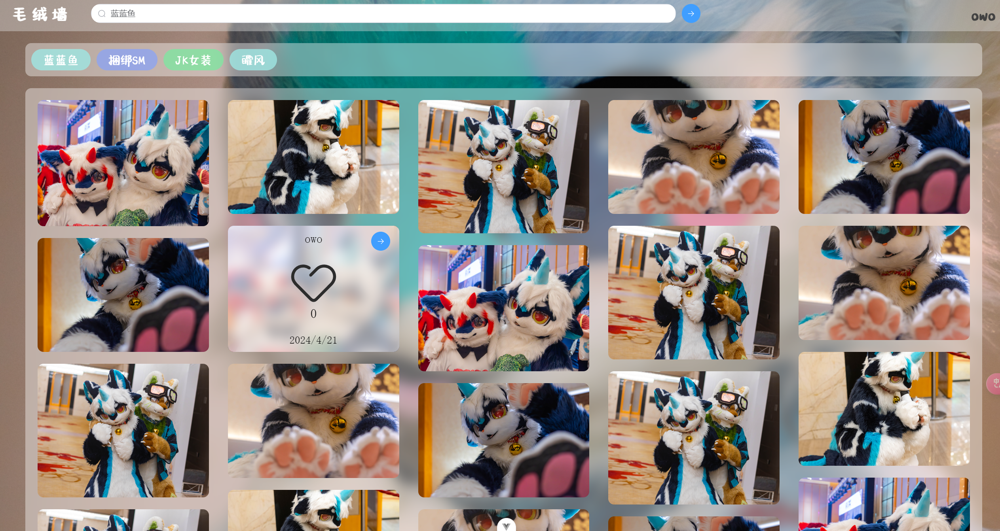

### 介绍

这是一个基于SpringBoot的开源相片展示平台，大致项目架构如下

- 后端：Springboot + Spring mvc + Mybatis plus
- 数据库&中间件：Mysql、redis、Elasticsearch
- 前端：Vue3 + Element UI Plus

项目基本功能

- 上传并展示图片，视频（TODO 视频功能预留接口待完善）
- 简单的点赞系统
- 以关键字对图片进行搜索
- 瀑布流为主的图片展示
- 用户中心
- 对Android手机（无IOS无法测试）和PC浏览器基本适配
- 后台管理

项目截图如下




### 使用

推荐使用docker-compose进行部署，`src/main/script`下提供基础的sql脚本和`docker-compose.yml`

需要的软件环境

- Mysql
- Elasticsearch 8.11.4（版本必须一致） + IK分词器
- redis 7
- jdk 21+

创建docker容器

```shell
docker network create --subnet=172.17.0.0/24  furry_image_net

docker run --network furry_image_net -d \
  --ip 172.18.0.11 \
  -m 10g --name furry-image-elasticsearch \
  -e "discovery.type=single-node" \
  -v /mnt/res/furry_image/config/elasticsearch/data:/usr/share/elasticsearch/data \
  -v /mnt/res/furry_image/config/elasticsearch/plugins:/usr/share/elasticsearch/plugins \
  -e  xpack.security.enabled=false \
  --privileged=true --restart always \
elasticsearch:8.11.4

# elasticsearch 创建完成后需要手动创建索引 执行以下命令
curl -X PUT http:// localhost:9200/keyword
curl -X PUT http:// localhost:9200/keyword_image

docker run --network furry_image_net \
  --ip 172.18.0.21 \
  --name furry_image_mysql --restart always  \
   -e MYSQL_ROOT_PASSWORD=010305 \
   -v /mnt/res/furry_image/config/mysql:/var/lib/mysql \
   -d \
   mysql --character-set-server=utf8mb4 --collation-server=utf8mb4_unicode_ci
   
docker run -d \
    --ip 172.18.0.2 \
    --name furry_image_redis_m1 \
    --restart always  \
    -v /mnt/res/furry_image/config/redis/:/usr/local/etc/redis \
    redis redis-server /usr/local/etc/redis/redis.conf   
    
docker run --network furry_image_net \
    --ip 172.18.0.41 -itd --name furry_image_java \
    --privileged=true -p 11000:8081 \
    -v /mnt/res/furry_image/data:/www/data \
    -v /mnt/res/furry_image/config/application.yml:/www/application.yml \
    -v /mnt/res/furry_image/config/show-furry-image.jar:/www/show-furry-image.jar
    furry_image:1.0
```

除此之外推荐使用Nginx，并使用ssl访问

```shell
docker run -d --name furry_image_nginx \
  -p 11000:11000 \
  -v /mnt/res/furry_image/config/nginx/nginx.conf:/etc/nginx/nginx.conf \
  -v /mnt/res/furry_image/config/nginx/conf.d:/etc/nginx/conf.d \
  -v /mnt/res/furry_image/config/nginx/html:/usr/share/nginx/html \
  -v /mnt/res/furry_image/config/nginx/logs:/var/log/nginx \
  -v /mnt/res/furry_image/config/nginx/ssl:/etc/ssl \
  --network furry_image_net \
  nginx
```

申请到ssl证书后放在/nginx/ssl目录下，然后配置nginx配置文件

```nginx
server {
    listen              11000 ssl http2;
    listen              [::]:11000 ssl http2;

    # SSL
    ssl_certificate     /etc/ssl/fullchain.crt;
    ssl_certificate_key /etc/ssl/private.pem;
    ssl_stapling on;
    ssl_stapling_verify on;
    ssl_session_timeout 5m;
    ssl_protocols TLSv1 TLSv1.1 TLSv1.2;  
    ssl_ciphers ECDHE-RSA-AES128-GCM-SHA256:HIGH:!aNULL:!MD5:!RC4:!DHE; 
    ssl_prefer_server_ciphers on;
	ssl_session_cache shared:SSL:1m;


    # logging
    access_log          /var/log/nginx/access.log combined buffer=512k flush=1m;
    error_log           /var/log/nginx/error.log warn;

    # reverse proxy
    location / {
        proxy_pass            http://172.18.0.41:8081 ;
		proxy_set_header   X-Forwarded-For   $remote_addr;
    }
}

# HTTP redirect
server {
    listen      11000;
    listen      [::]:11000;
    return      301 https://image.owofurry.fun:11000$request_uri;
}
```

进入mysql，将`src/main/script/furry_image.sql`导入到数据库，初次运行

```
java -jar furry-image.jar
```

使用docker创建一个JAVA21的运行环境，并映射furry-image.jar到容器中，此处映容器中/www

```shell
docker run --network furry_image_net  \
    --ip 172.18.0.41 -itd --name furry_image_java \
    --privileged=true  \
    -v /mnt/res/furry_image/data:/www/data  \
    -v /mnt/res/furry_image/config/application.yml:/www/application.yml \
    -v /mnt/res/furry_image/config/show-furry-image.jar:/www/show-furry-image.jar 
openjdk:21 java -jar /www/show-furry-image.jar
```

由于验证码生成需要安装libfreetype6和Fontconfig，所以执行如下命令，随扈重启服务器,这里使用的debain
其他系统自行搜索安装方式

```shell
apt-get install -y fontconfig
fc-cache --force
apt-get install libfreetype6
```

完成后会因环境未配置自动退出，修改生成的`cong.yml`配置文件

```yml
spring:
  datasource:
    username: 数据库用户名
    password: 数据库密码
  elasticsearch:
    uris: Elasticsearch 地址
  data:
    redis:
      host: redis连接地址
  mail:
    # 指定邮件服务器地址
    host:
    # 登录账户
    username:
    # 登录密码
    password:
    # 端口
    port:
    # 使用的协议
    protocol: smtps
server:
  port: 8081
# 自定义配置
config:
  system:
    max-file-size: 10
    show-no-check: true
    max-file-num: 5
  path:
    image: images
    video: videos
```

