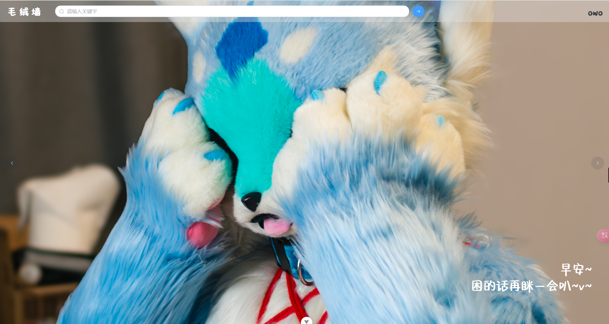
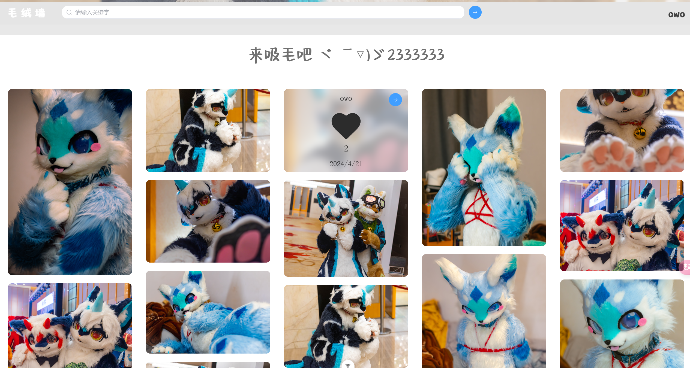
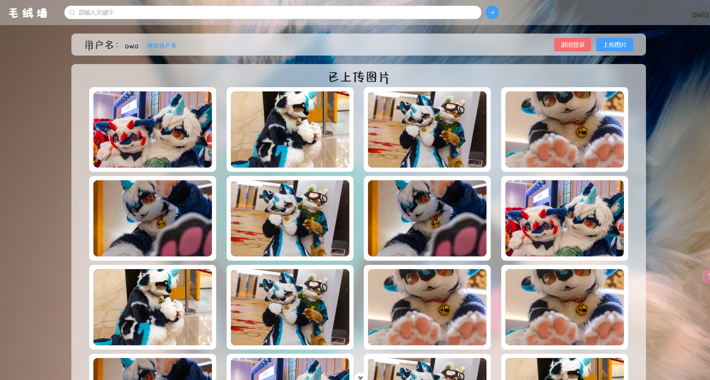

v

### 介绍

这是一个基于SpringBoot的开源相片展示平台，大致项目架构如下

- 后端：Springboot + Spring mvc + Mybatis plus
- 数据库&中间件：Mysql、redis、Elasticsearch
- 前端：Vue3 + Element UI Plus

项目基本功能

- 上传并展示图片，视频（TODO 视频功能预留接口待完善、上传页面待完成 ）
- 简单的点赞系统
- 以关键字对图片进行搜索
- 瀑布流为主的图片展示
- 用户中心
- 对Android手机（无IOS无法测试）和PC浏览器基本适配
- 后台管理（TODO vue未编写，controller待完善，Service已完成）

项目截图如下








### 使用

推荐使用docker-compose进行部署，`src/main/script`下提供基础的sql脚本和`docker-compose.yml`

需要的软件环境

- Mysql
- Elasticsearch 8.11.4（版本必须一致） + IK分词器
- redis 7
- jdk 21+

进入mysql，将`src/main/script/furry_image.sql`导入到数据库，初次运行

```
java -jar furry-image.jar
```

完成后会因环境未配置自动退出，修改生成的`cong.yml`配置文件

```yml
spring:
  application:
    name: show-furry-image
  profiles:
    active: dev
  datasource:
    driver-class-name: com.mysql.cj.jdbc.Driver
    username: root
    password: "010305"
    url: jdbc:mysql://localhost:3306/furry_image
  elasticsearch:
    uris: http://localhost:9200
  mail:
    # 指定邮件服务器地址
    host: smtp.163.com
    # 登录账户
    username: qq2818324149@163.com
    # 登录密码
    password: "KEZXOOEBFPPLESRI"
    # 端口
    port: 465
    # 默认编码
    default-encoding: UTF-8
    # 使用的协议
    protocol: smtps
    # 其他的属性
    properties:
      "mail.smtp.connectiontimeout": 5000
      "mail.smtp.timeout": 3000
      "mail.smtp.writetimeout": 5000
      "mail.smtp.auth": true
      "mail.smtp.starttls.enable": true
      "mail.smtp.starttls.required": true
  cache:
    type: redis
    redis:
      time-to-live: 180000
  servlet:
    multipart:
      max-file-size: 10MB
      max-request-size: 500MB
  config:
    import: file:${user.dir}${file.separator}config.yml
  web:
    resources:
      cache:
        cachecontrol:
          cache-public: true
          max-age: 3153600
          must-revalidate: true
      static-locations: file:${config.path.base}
  mvc:
    static-path-pattern: /raw/**
mybatis:
  configuration:
    map-underscore-to-camel-case: true
mybatis-plus:
  global-config:
    banner: false
server:
  port: 8081
# 自定义配置
config:
  system:
    max-file-size: 10
    show-no-check: true
    max-file-num: 5
  path:
    image: images
    video: videos
    base: ${user.dir}${file.separator}data${file.separator}
```

